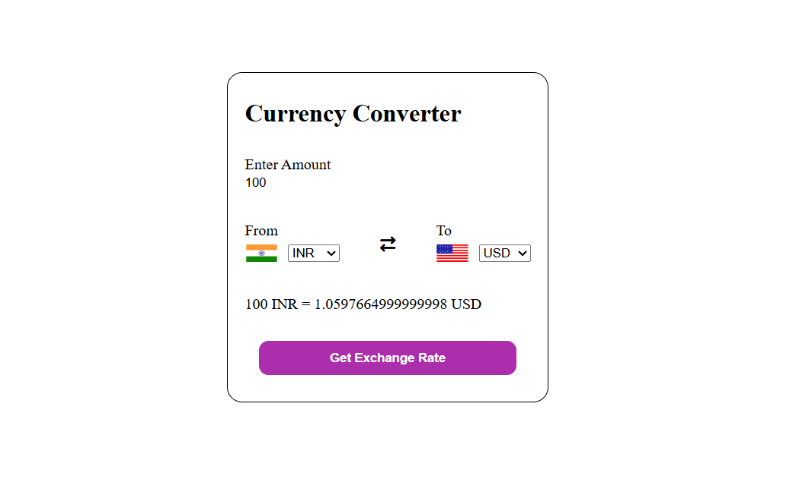

# 💱 Currency Converter

A simple and responsive Currency Converter web application built using **HTML**, **CSS**, and **JavaScript**. This project allows users to convert currencies in real-time using a Currency Exchange API and dynamically updates country flags based on the selected states using a Flag API.

---

## 🚀 Features

- 🌍 Convert currencies in real-time
- 🏳️ Dynamic country flag updates
- 🔄 Swap currencies easily

---

## 🛠️ Technologies Used

- HTML5
- CSS3
- JavaScript (ES6)
- Currency Exchange API
- Flags API

---

## 📖 What I Learned

While building this project, I practiced:

- Fetch API
- Async/Await
- Promises
- DOM Manipulation
- Event Handling
- Working with External APIs
- Dynamic UI Updates
- JavaScript Objects

---

## 📸 Screenshot

---

## ▶️ How to Run

1. Clone the repository

2. Open the project folder.

3. Open `index.html` in your browser.

---

⭐ This project is part of my **JavaScript Practice Projects** repository where I regularly build mini projects to strengthen my JavaScript and frontend development skills.